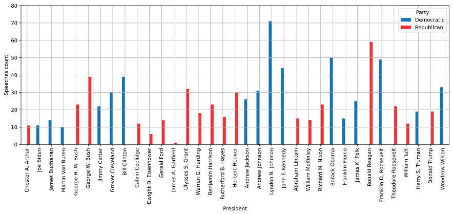
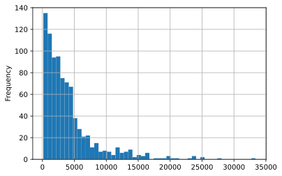

# Predict POTUS affiliation

All the code for the Machine Learning I-II assignment (MA DTA 2021).

## Objective

Use famous speeches delivered by US Presidents and train 2 machine learning and 2 deep learning models to classify them in the political (Democratic or Republican) party of the speaker.

## Exploratory Data Analysis (EDA)

Every ML/DL task starts with getting familiar with the data that are going to be passed into the pipeline(s). In this case, a corpus with 878 speeches by either a Democratic or a Republican POTUS is gathered. The original corpus is [available on Kaggle](https://www.kaggle.com/datasets/littleotter/united-states-presidential-speeches). Let's see some graphs that will let us get a basic understanding of the data at our displosal.

Speeches per party:

Speeches per president:

Distribution of total words:

## Models

The objective is to train the models to predict the political affiliation (party) of the speaker.

### Machine learning

1. Logistic Regression (LR)
2. Support Vector Machines (SVM)

### Deep Learning

1. Convolutional Neural Network (CNN)
2. Long Short-Term Memory Recurrent Neural Network (LSTM-RNN)

In both cases of the deep learning algorithms, GloVe pre-trained word embeddings were used.

## Report

See the [short Report](Report.md) explaining briefly the rationale behind each model and the results.
